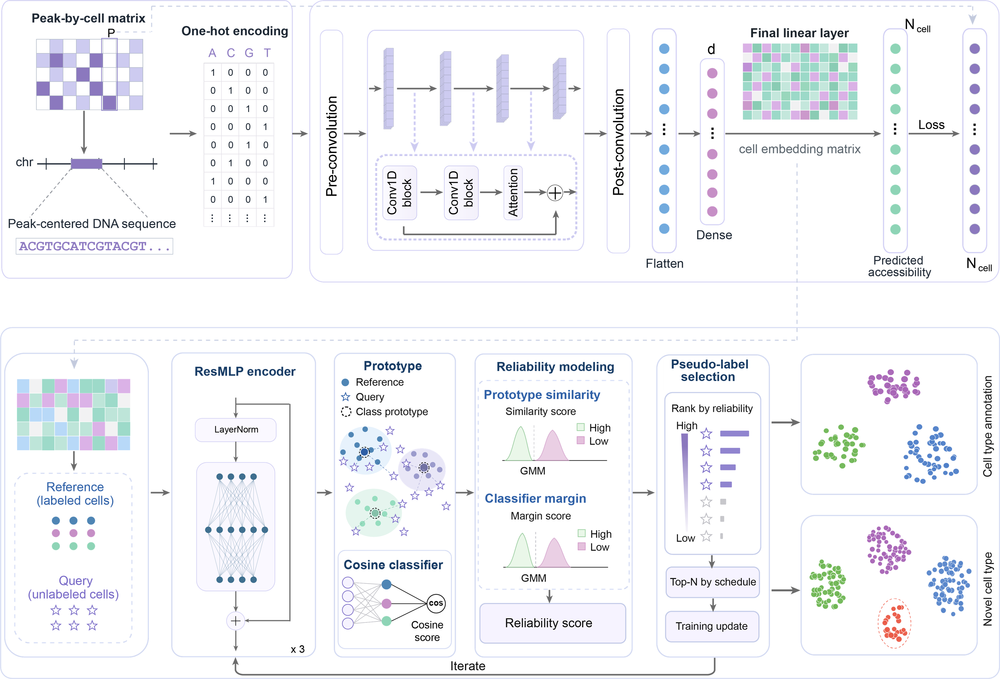

# **ProCAT**

Welcome to the `ProCAT` framework repository!

`ProCAT` is a computational framework for cell-type annotation of single-cell ATAC-seq (scATAC-seq) data. The framework consists of two main components. **Part I** models chromatin accessibility using genomic sequence information and learns low-dimensional cell representations from scATAC-seq data. The output of Part I is then divided into labeled **reference** cells and **query** cells using the provided data-splitting script. **Part II** performs reference-to-query cell-type prediction using an iterative pseudo-labeling strategy.

The complete ProCAT workflow is:

1. **Part I: Single-cell Accessibility Modeling**
2. **Reference/Query Data Split**
3. **Part II: Cell-type Prediction**

<p align="center">

  

</p>

## **Requirements**

You may create an Anaconda environment for `ProCAT` with the following commands:

```bash
git clone https://github.com/NXU-Shilab/ProCAT.git
cd ProCAT
conda env create -f environment.yml
conda activate ProCAT
```

The provided Conda environment includes the major dependencies required by ProCAT, including:

- Python 3.10
- PyTorch 2.4.1
- CUDA 11.8
- Scanpy 1.10.3
- AnnData 0.10.9
- NumPy
- SciPy
- Pandas
- scikit-learn
- h5py
- tqdm
- UMAP
- igraph
- leidenalg

`ProCAT` is designed to run in a GPU-enabled environment. A CUDA-compatible NVIDIA GPU is recommended for both Part I and Part II.

You can check whether PyTorch recognizes your GPU using:

```bash
python -c "import torch; print(torch.__version__); print(torch.cuda.is_available())"
```

# **Part I. Single-cell Accessibility Modeling**

## **Datasets**

### **1. Using datasets from our study**

The datasets used in our study are publicly available from the following repositories:

```
Human brain-region scATAC-seq: GEO accession GSE244618
Human multi-tissue scATAC-seq: GEO accession GSE184462
Human hematopoietic system (Buenrostro2018): GEO accession GSE96769; processed data are available from the scATAC-seq benchmarking repository.
Alzheimer's disease snRNA-seq and snATAC-seq: GEO accession GSE214979
Lymphoma multi-omic dataset: Fresh-Frozen Lymph Node with B Cell Lymphoma, 14k sorted nuclei from 10x Genomics.
```

### **2. Using your own scATAC-seq dataset**

You can also apply ProCAT to your own scATAC-seq dataset.

The input dataset must be stored in AnnData (`.h5ad`) format.

The chromatin accessibility matrix should be stored in:

```python
adata.X
```

where rows represent cells and columns represent accessible chromatin regions (peaks).

`adata.var` must contain at least the following three columns:

- `'chr'`: chromosome of each peak
- `'start'`: genomic start position of each peak
- `'end'`: genomic end position of each peak

For example:

```
             chr       start       end
peak_1       chr1      100000      100500
peak_2       chr1      120000      120500
peak_3       chr2      250000      250500
```

Cell-type annotations should be stored in either:

```python
adata.obs["CellType"]
```

or:

```python
adata.obs["cell_type"]
```

A `barcode` column is recommended:

```python
adata.obs["barcode"]
```

If `barcode` is not present, `adata.obs_names` will be used as cell barcodes during the reference/query splitting step.

## **Reference Genome**

Part I requires an encoded reference-genome HDF5 file corresponding to the genome assembly used by the scATAC-seq dataset.

Supported genome assembly names are:

```
hg19
hg38
mm9
mm10
```

The genome file can be specified using:

```
--genome-file
```

For example:

```
/path/to/hg38.fa.h5
```

The current implementation reads an **encoded HDF5 genome file rather than a raw FASTA file**.

Alternatively, the genome path can be supplied through an environment variable. For example, for hg38:

```bash
export PROCAT_GENOME_HG38=/path/to/hg38.fa.h5
```

## **Train**

To train Part I and generate cell embeddings, run:

```bash
python part1/train_pipeline.py \
  -i data/example.h5ad \
  -g hg38 \
  --genome-file data/hg38.fa.h5 \
  -o results/part1 \
  --device 0
```

## **Part I Output**

After training, the output directory contains files including:

```
results/part1/
├── CACNN_best_model.pt
├── CACNN_train.log
└── CACNN_output.h5ad
```

The file:

```
CACNN_output.h5ad
```

contains the cell representations generated by Part I and is required for the next data-splitting step.

# **Reference/Query Data Split**

Before running Part II, the output generated by Part I must be processed using:

```
scripts/splitdata.py
```

This step divides cells from each cell type into a labeled **reference** set and a **query** set. The split is first generated using the original scATAC-seq AnnData object and then transferred to the embeddings generated by Part I using cell barcodes.

Therefore, this step requires both:

1. the original `.h5ad` file used in Part I; and
2. the `CACNN_output.h5ad` file generated by Part I.

## **Run Data Split**

```bash
python scripts/splitdata.py \
  --original-h5ad data/example.h5ad \
  --embedding-h5ad results/part1/CACNN_output.h5ad \
  --ratio 0.6 \
  --seed 42 \
  --output-dir results/split
```

## **Split Output**

The splitting step generates:

```
results/split/
├── radio_ad.h5ad
└── radio_partOne_embed.h5ad
```

`radio_ad.h5ad` contains the reference/query assignments in the original feature space.

`radio_partOne_embed.h5ad` contains the Part-I embeddings together with the annotations required by Part II.

Specifically, the output contains:

```python
adata.obs["Batch"]
```

with two groups:

```
reference
query
```

and:

```python
adata.obs["CellType"]
```

containing the cell-type annotations.

The file:

```
radio_partOne_embed.h5ad
```

is used as the direct input for Part II.

# **Part II. Cell-type Prediction**

Part II performs reference-to-query cell-type prediction using the embeddings generated by Part I.

The reference cells are used as labeled training samples, while query cells are progressively incorporated into training through an iterative pseudo-labeling strategy.

## **Train and Predict**

Run Part II using:

```bash
python part2/main.py \
  -i results/split/radio_partOne_embed.h5ad \
  --source_batch reference \
  --target_batch query \
  --gpu 0 \
  --o results/part2 \
  --o_name run1
```

## **Part II Output**

For the example above, Part II creates:

```
results/part2/run1/
├── run.log
└── embedding.h5ad
```

`run.log` records the training process, pseudo-label selection statistics, and final evaluation metrics.

The final evaluation includes:

- Accuracy
- Macro-F1
- Weighted-F1
- Cohen's Kappa

The file:

```
embedding.h5ad
```

contains the learned Part-II representation for both reference and query cells.

Predicted cell-type labels are stored in:

```python
adata.obs["predict"]
```

Original cell metadata are retained in the output AnnData object.

# **Complete Workflow**

The complete ProCAT workflow can be executed as follows:

```bash
# Activate the environment
conda activate ProCAT


# Part I: single-cell accessibility modeling
python part1/train_pipeline.py \
  -i data/example.h5ad \
  -g hg38 \
  --genome-file data/hg38.fa.h5 \
  -o results/part1 \
  --device 0


# Reference/query data split
python scripts/splitdata.py \
  --original-h5ad data/example.h5ad \
  --embedding-h5ad results/part1/CACNN_output.h5ad \
  --ratio 0.6 \
  --seed 42 \
  --output-dir results/split


# Part II: cell-type prediction
python part2/main.py \
  -i results/split/radio_partOne_embed.h5ad \
  --source_batch reference \
  --target_batch query \
  --gpu 0 \
  --o results/part2 \
  --o_name run1
```

